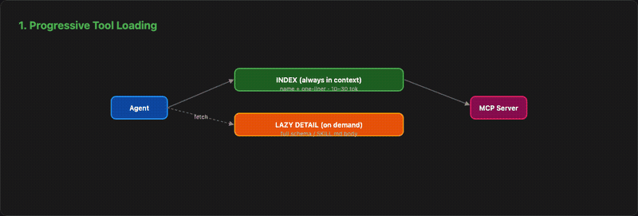
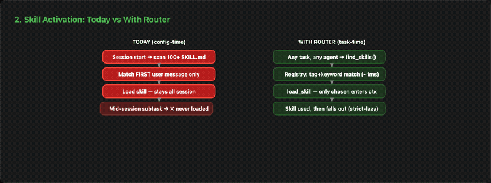
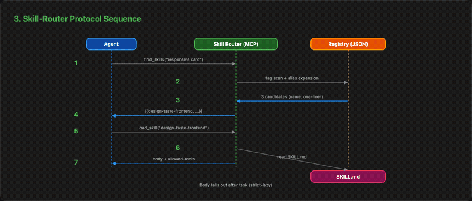
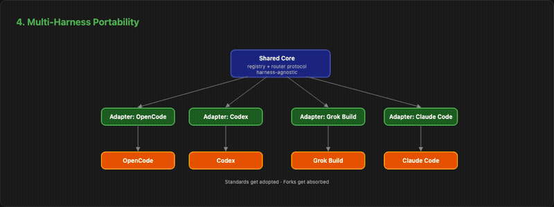
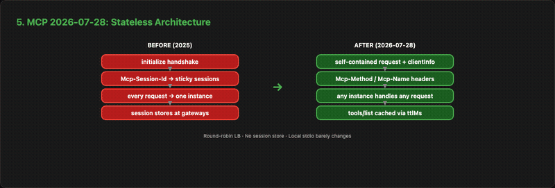

# Agent Stack Research

> The public research base for the **skill routing layer** — a harness-agnostic,
> task-time router for skills and MCP tools. Your stack. Your rules. Every harness.

Research (2026) into the Model Context Protocol's evolution, progressive tool
loading, the skills-vs-tools-vs-MCP tradeoff, the multi-harness landscape, and
routing/registry patterns — plus a draft open registry format (v0.1) for
routing skills at task time instead of pinning them at config time.

## Why this exists

Agent harnesses (OpenCode, Claude Code, Codex, Grok Build) each ship their own
skill system, MCP wiring, and plugin surface. Users accumulate 100+ skills and
dozens of MCPs. Skill activation is a heuristic (prose-description matching at
session start), context bloat grows with every connected server, and nothing is
portable across harnesses. Users are handed down a stack; they cannot cleanly
bring their own.

This repo is the written thesis: research first, then a neutral routing layer
(registry format + router protocol), with a reference implementation.

## TL;DR — what the research says

1. **MCP went stateless (2026-07-28).** `initialize` handshake and
   `Mcp-Session-Id` are gone; `server/discover`, `Mcp-Method`/`Mcp-Name`
   headers, `ttlMs` caching, and a formal SEP process arrived. Remote HTTP
   servers must migrate; **local stdio servers barely change**.
2. **Progressive tool loading is the default pattern.** Index (name + one-line,
   10–30 tokens/tool) stays in context; full schemas load on demand. Anthropic
   measured **150k → 2k input tokens (98.7% drop)**. Break-even: 15–30 tools.
3. **Skills and tools are converging on the same routing problem.** Skill
   frontmatter descriptions are the routing signal; the SKILL.md body is the
   decisive one. "Skill routers" and "MCP routers" solve the same dispatch
   question — the routing layer is the real integration point.
4. **Portability is closer than it looks.** SKILL.md + MCP are already
   cross-harness; hook surfaces are converging on identical protocols. OpenCode
   is the easiest port target, Claude Code the hardest.
5. **Two-tier routing wins.** Deterministic tag+keyword matching (~1ms, 80–90%
   of cases) with a semantic (embedding) fallback — no LLM call inside the
   router itself. LLM-only selection degrades beyond ~15 tools.

## Repository map

```
docs/
├── STRATEGY.md                          ← thesis: wedge+moat, clean-room, metrics
├── 01-mcp-evolution.md                  ← MCP 2025 → 2026-07-28, stateless core, SEPs
├── 02-progressive-tool-loading.md       ← index/lazy-detail pattern, Anthropic numbers
├── 03-tools-vs-skills-vs-mcp.md         ← context costs, skill-embedded MCPs, discovery
├── 04-harness-landscape.md              ← OpenCode / Claude Code / Codex / Grok Build
├── 05-routing-registry-patterns.md      ← selectors, registries, two-tier routing
└── diagrams.md                          ← protocol + routing flows (Mermaid)
diagrams/
├── 01-progressive-loading.svg           ← before/after context bloat visualization
├── 01-progressive-loading.gif           ← animated version
├── 02-activation-comparison.svg         ← heuristic vs two-tier routing comparison
├── 02-activation-comparison.gif         ← animated version
├── 03-router-protocol.svg               ← find_skills/load_skill MCP protocol flow
├── 03-router-protocol.gif               ← animated version
├── 04-multi-harness.svg                 ← adapter architecture across harnesses
├── 04-multi-harness.gif                 ← animated version
├── 05-mcp-stateless.svg                 ← MCP stateless migration (stdio vs HTTP)
├── 05-mcp-stateless.gif                 ← animated version
└── animations.html                      ← animated dark-theme diagram page
spec/
└── REGISTRY-v0.1.md                     ← open skill-registry format draft (MIT/Apache-2.0)
tests/
├── adapters/
│   ├── opencode-adapter.js              ← OpenCode adapter (native path)
│   ├── claude-code-adapter.js           ← Claude Code adapter (path remap)
│   └── codex-adapter.js                 ← Codex adapter (hash-trusted paths)
├── test-portability.js                  ← 20-test cross-harness validation suite
└── PORTABILITY-REPORT.md                ← test results summary
```

## Cross-harness portability

Adapters tested and passing (20/20):

| Harness | Path convention | Adapter |
|---------|-----------------|---------|
| OpenCode | `~/.config/opencode/skills/<name>/SKILL.md` | `opencode-adapter.js` |
| Claude Code | `~/.claude/skills/<name>/SKILL.md` | `claude-code-adapter.js` |
| Codex | `~/.codex/skills/<hash>/<name>/SKILL.md` | `codex-adapter.js` |

See `tests/PORTABILITY-REPORT.md` for full results.

## Diagrams

### Progressive Loading — Before/After



### Activation Comparison — Heuristic vs Two-Tier



### Router Protocol — find_skills / load_skill



### Multi-Harness Adapters



### MCP Stateless Migration



> Static SVGs also available in `diagrams/`. Interactive version: open `diagrams/animations.html`.

## The shape of the moat

**Wedge** — a multi-harness plugin that demos the routing layer ("your stack,
your rules, every harness").

**Moat** — the skill routing layer: a harness-agnostic registry format +
task-time router protocol. Standards get adopted; forks get absorbed. The spec
is the defensible part; the plugin is the adoption vehicle.

**Reach** — thin adapters over a shared core: OpenCode → Claude Code → Codex →
Grok Build.

Precedent: MCP = spec + SDKs + reference servers. Terraform = format + CLI.
We write the standard in public — this repo.

## License

Apache-2.0 — except research sections, which cite their sources (each doc ends
with a Sources list). The spec (`spec/`) is intentionally the most open part:
the format is the standard.
