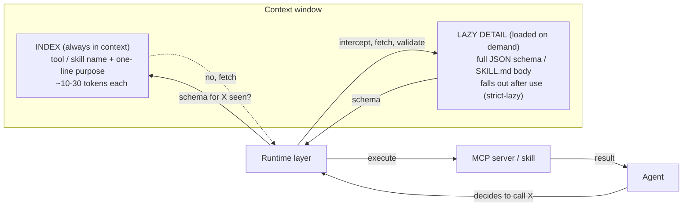
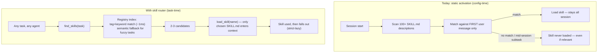
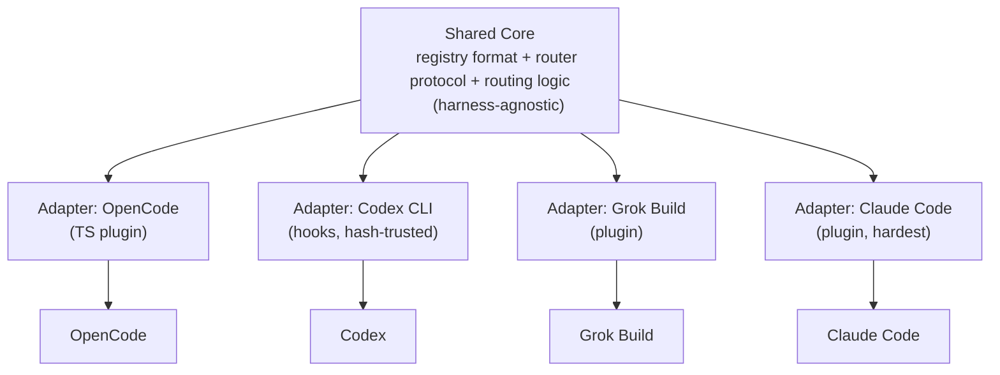
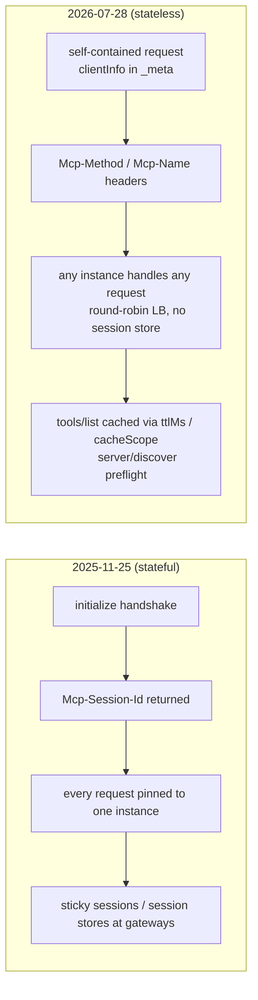

# Diagrams

Mermaid diagrams — rendered natively on GitHub. Animated GIF versions are a
planned follow-up (pipeline: HTML animation → ffmpeg → GIF).

## 1. Progressive tool loading (index → lazy detail)



## 2. Session start vs task time — skill activation today vs with a router



## 3. The skill-router protocol (v0.1)

```mermaid
sequenceDiagram
    participant A as Agent (any harness)
    participant R as Skill Router (local stdio MCP)
    participant G as Registry (registry.json)
    participant S as SKILL.md (on disk)

    A->>R: find_skills("responsive card component")
    R->>G: keyword/tag scan + alias expansion
    G-->>R: 3 candidates (name, one-liner, tags)
    R-->>A: [{design-taste-frontend, ...}, {frontend-design, ...}]
    A->>R: load_skill("design-taste-frontend")
    R->>S: read SKILL.md + embedded config
    S-->>R: full body
    R-->>A: body + allowed-tools + optional embedded MCP manifest
    Note over A: skill instructions in context; body falls out after task
```

## 4. Multi-harness portability (the wedge shape)



## 5. MCP 2026-07-28 — stateless architecture


